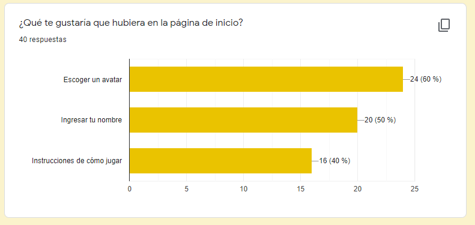
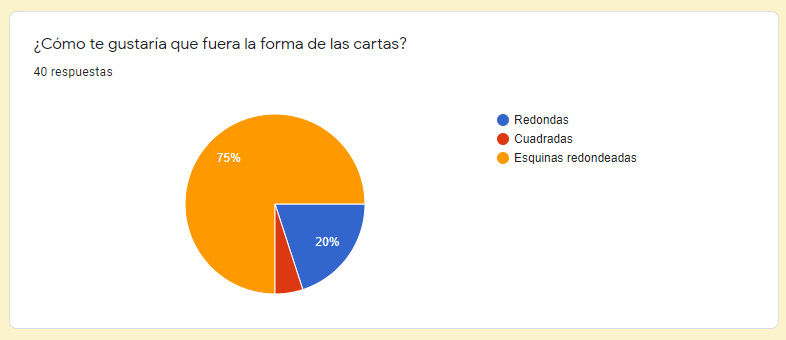
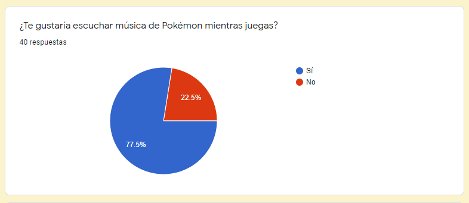
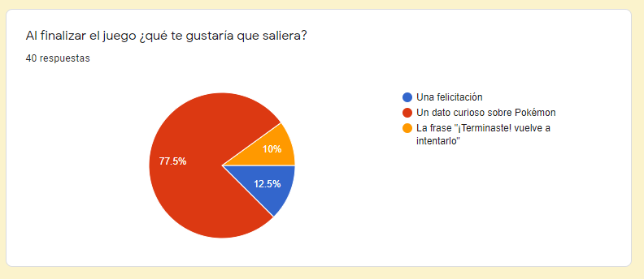
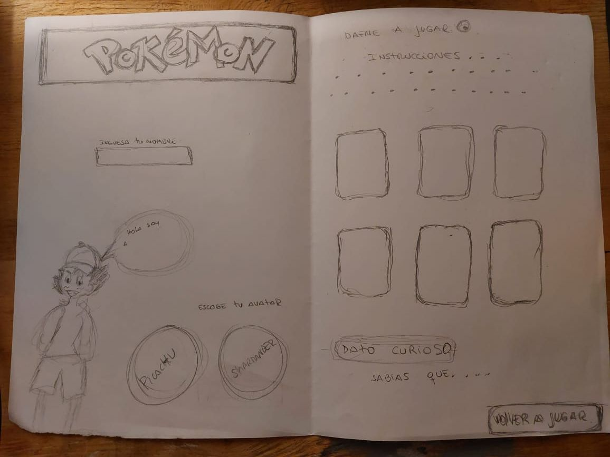
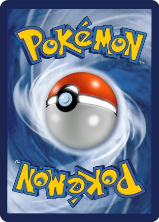

# MEMORY MATCH POKÉMON 👾

## Autoras:
 * Dafne Bascuñán 
 * M. Paz Jélvez

## 1. Definición del producto

El juego _"Memory Match"_, también conocido como _Memorice_ o _Memorama_, es un juego de mesa con una baraja de cartas específicas. El objetivo consiste en encontrar los pares con la misma figura impresa utilizando la memoria.

### 1.1 Investigación de Usuarios

Se creó una encuesta online que se envió a potenciales usuarios de nuestro sitio. En ella incluimos las siguientes preguntas (y sus resultados):

### 1.2 Historias de Usuario

A partir de la información obtenida de nuestra encuesta, creamos las siguientes historias de Usuario:

1. Como fan de Pokémon, quiero escoger un Avatar (o personaje), para que sea personalizado.
2. Como fan de Pokémon, quiero agregar mi nombre de usuario, para que sea más personalizado.
3. Como fan de Pokémon, quiero que las cartas tengan esquinas redondeadas, para que parezcan cartas reales de Pokémon.
4. Como fan de Pokémon, quiero que el juego tenga música, para así sentir que estoy dentro del mundo Pokémon.
5. Como fan de Pokémon, quiero que las cartas giren de dos en dos y que hagan match, para poder divertirme.
6. Como fan de Pokémon, quiero un dato curioso al finalizar el juego, para poder aprender más sobre Pokémon.

## 2. Sketch de la Solución

### 2.1 Creación de Prototipo de baja fidelidad

Creamos un prototipo de baja fidelidad, para poder plasmar cómo queríamos que se viera nuestra página

### 2.2 Prototipo de Baja Fidelidad

A continuación se puede ver cómo quedó nuestro Sketch:
 

 ## 3. Diseño de la Interfaz de Usuario

 ### 3.1 Creación de prototipo de Alta Fidelidad

 Utilizando la aplicación _Figma_, creamos un prototipo de alta fidelidad para poder aplicar las historias de usuario y ayudarnos a tener una idea de cómo se verá nuestro sitio y esto nos permitió realizar mejoras en la solución.

 ### 3.2 Prototipo de Alta Fidelidad

 A continuación se puede observar nuestro prototipo de Alta Fidelidad:
 

 ## 4. Creación de sitio

 ### 4.1 Maquetación y diseño general

 Creamos la maqueta en HTML de los elementos que se verían en el sitio, a excepción de las cartas, que serían agregadas a través de JavaScript.
 Utilizando CSS, fuimos agregando el diseño a cada elemento, a medida que los incluíamos en nuestro HTML.

 ### 4.2 Creación de cartas a través de JavaScript

 Importamos desde el archivo de data, toda la información referente a cada carta, a excepción de la parte trasera de las mismas, que fue agregada por nosotras mismas, simulando una carta real de Pokémon:

 

Utilizando CSS, ubicamos el tablero con cartas en nuestro sitio y le dimos forma a las mismas. Además, agregamos las funciones de barajar, girar y hacer match.

### 5. Test de Usabilidad

Se envió la página a varios usuarios para que puedieran jugar y nos dieran su apreciación sobre la misma. Recibimos muy buenos comentarios y como problema de usabilidad se detectó que al hacer click en la última carta, la alerta que indica que el juego terminó aparece antes de que la carta se gire.

## 6. Despliegue de la página

Para poder ver nuestro resultado, se puede acceder a nuestra página [Aquí](https://mpazjelvez.github.io/SCL019-memory-match/src/index.html)
